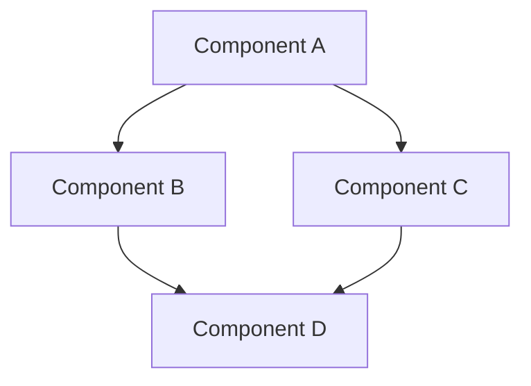

# System Patterns

## Architecture Overview

[Provide a high-level description of the system architecture]

### System Architecture

[Modify the diagram to represent your actual system architecture]

## Core Components

### 1. [Component 1]

- [Responsibility]
- [Responsibility]
- [Responsibility]
- [Responsibility]

### 2. [Component 2]

- [Responsibility]
- [Responsibility]
- [Responsibility]
- [Responsibility]

### 3. [Component 3]

- [Responsibility]
- [Responsibility]
- [Responsibility]
- [Responsibility]

### 4. [Component 4]

- [Responsibility]
- [Responsibility]
- [Responsibility]
- [Responsibility]

## Design Patterns

### 1. [Pattern 1]

- [Key characteristic]
- [Key characteristic]
- [Key characteristic]
- [Key characteristic]

### 2. [Pattern 2]

- [Key characteristic]
- [Key characteristic]
- [Key characteristic]
- [Key characteristic]

### 3. [Pattern 3]

- [Key characteristic]
- [Key characteristic]
- [Key characteristic]
- [Key characteristic]

## Data Flow

### [Stage 1]

- [Data flow description]
- [Data flow description]
- [Data flow description]
- [Data flow description]

### [Stage 2]

- [Data flow description]
- [Data flow description]
- [Data flow description]
- [Data flow description]

### [Stage 3]

- [Data flow description]
- [Data flow description]
- [Data flow description]
- [Data flow description]

## Error Handling

### 1. [Error Handling Strategy 1]

- [Strategy description]
- [Strategy description]
- [Strategy description]
- [Strategy description]

### 2. [Error Handling Strategy 2]

- [Strategy description]
- [Strategy description]
- [Strategy description]
- [Strategy description]

## Performance Patterns

### 1. [Performance Strategy 1]

- [Strategy description]
- [Strategy description]
- [Strategy description]
- [Strategy description]

### 2. [Performance Strategy 2]

- [Strategy description]
- [Strategy description]
- [Strategy description]
- [Strategy description]

## Security Patterns

### 1. [Security Strategy 1]

- [Strategy description]
- [Strategy description]
- [Strategy description]
- [Strategy description]

### 2. [Security Strategy 2]

- [Strategy description]
- [Strategy description]
- [Strategy description]
- [Strategy description]
